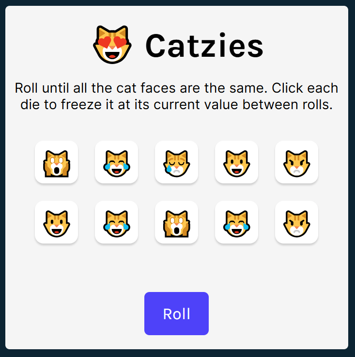

# Catzies



- [Catzies](#catzies)
  - [About](#about)
  - [Play Game](#play-game)
  - [How to Play](#how-to-play)
  - [Architecture](#architecture)
  - [Demo Videos](#demo-videos)
  - [Getting Started](#getting-started)
  - [References](#references)

## About
Catzies is a demo React application that allows users to play the game of Tenzies, but with a fun twist: instead of numbers, the dice feature cat faces. The objective of the game is to get all dice to show the same cat face. This project showcases the use of React for building interactive user interfaces and managing game state.

## Play Game
Check out the live demo and [Play Catzies - Coming Soon](#).

## How to Play
Catzies (Tenzies) is a simple and fun dice game. The objective is to get all dice to show the same cat face. Here’s how to play:

1. Roll all the dice by clicking the "Roll" button.
2. Select the dice you want to keep by clicking on them. These dice will not be rolled in the next roll.
3. Roll the remaining dice.
4. Repeat steps 2 and 3 until all dice show the same cat face.
5. Once all dice show the same cat face, you win the game!

## Architecture

The project structure is organized as follows:

- `index.html`: The main HTML file that sets up the basic structure of the application.
- `index.jsx`: The entry point for the React application, rendering the `App` component.
- `index.css`: The main CSS file for styling the application.
- `components/`: Contains React components used in the application.
  - `App.jsx`: The main component that manages the game logic and state.
  - `Die.jsx`: A component representing an individual die.
- `data/`: Contains data files used in the application.
  - `cats.js`: A file containing an array of cat emojis and their labels.
- `images/`: Contains image assets used in the application.
  - `favicon.ico`: The favicon for the application.
- `sounds/`: Contains sound assets used in the application.
  - `catscream.mp3`: The sound played when the dice are rolled.
- `package.json`: Contains the project dependencies and scripts.
- `vite.config.js`: Configuration file for Vite, the build tool used in the project.

The main component, `App.jsx`, manages the state of the dice and handles the game logic. It uses the `Die.jsx` component to render each die. The `cats.js` file provides the data for the cat emojis displayed on the dice. The application also includes a sound effect that plays when the dice are rolled, which is imported from the `sounds/` directory.

## Demo Videos
Include links to demo videos here. Coming Soon

## Getting Started
Install the dependencies and run the project
```
npm install
npm start
```

Head over to https://vitejs.dev/ to learn more about configuring vite

## References
This project was inspired by the game of Tenzies (Scrimba - Learn React - Capstone Project #1) and the idea of using cat faces as dice. The following resources were helpful in building this project:

Scrimba React Course: https://scrimba.com/learn/learnreact